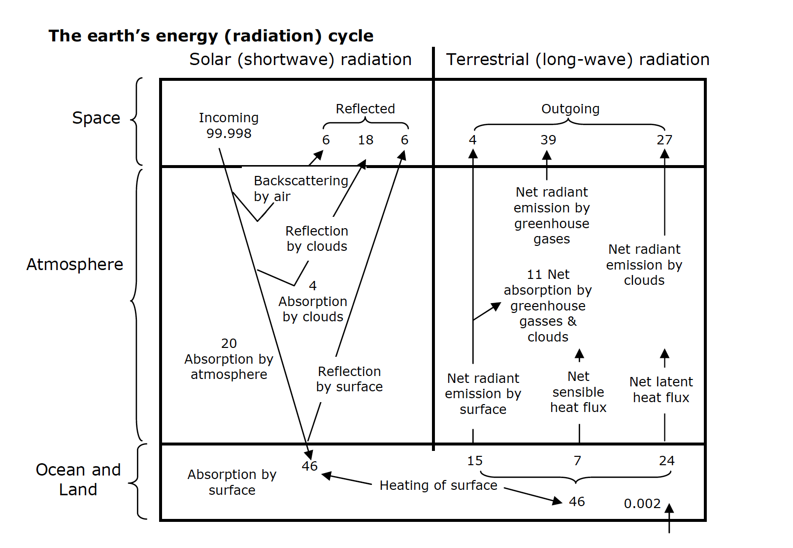

# Lecture 2: Where does the energy come from on Earth?

In this lecture we are going to consider where the energy comes from on the planet.
The energy ultimately comes from the sun, which delivers $341.5 \ \mathrm{W  m^{-2}}$ to the Earth.
The way that our planet receives this energy, redistributes this energy, and the chemical, physical and biological reactions that harness or result from this energy drives all environmental and climate systems.
Therefore, this is where it all begins.
You will revisit these concepts later in the course, when we study the Global Environment in Lent term.
When we work on these concepts then, we’ll delve more into the mathematics behind them.
Here we will cover the broad topics more as an overview of the planetary system.

Earth doesn’t get all the power that the sun sends our way.

- Some is absorbed by gas in the atmosphere.
- Some bounces off clouds and returns to space through Rayleigh Scattering.
- Some is absorbed by clouds.
- Some bounces off the surface of the planet (particularly bright surfaces like snow).

About 46% is absorbed by the surface.

Our planet also re-radiates energy but this energy is at a longer wavelength than what we receive from the sun.

What are each of these things happening on Earth’s surface? The heating of Earth’s surface drives physical changes which allows heat (in the form of radiation) to be released into the atmosphere.

For example, when water changes state from liquid to vapor during evaporation, this is called the latent heat flux, while when there is a temperature change at the surface but no change in state, this energy is released to the atmosphere as the sensible heat flux. You will have learned about latent heat and sensible heat in GCSE Physics.

Different gases in our atmosphere are good at absorbing radiation or releasing radiation of different wavelengths. You have probably seen the figure on the right, it shows the downward transmission of solar radiation and the upgoing longwave radiation. Gases in our atmosphere both absorb wavelengths of radiation that are short (as in those coming from the sun) and long (as those emitted from the Earth). Different gases behave differently, and later this term you will learn what in the physics of the molecule makes a good greenhouse gas.

The balance of energy coming in from the sun and then interacting with the surface of the planet, causing both changes of state and changes in local temperature, and the transmission of this energy through the atmosphere, this drives the hydrological cycle, the movement of heat, air, water, and the carbon in that air and water. What the Earth does with the energy it receives, and the impact that this has on the climate system, is the focus of this course.

The sun doesn’t heat the Earth’s surface evenly, but the reradiation of energy from Earth’ surface is more even. This leads to global energy imbalance that drives the transfer of water and air.

The heat is transferred when warm air rises and moves towards colder regions, and when warm water is moved in the oceans from the tropics (warm) to the poles (cold). We can quantify the energy transfer and parse it into which fraction is transported by the air and which is transported by the water.