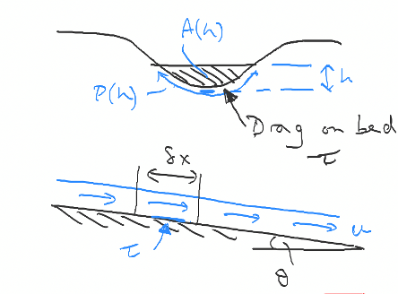
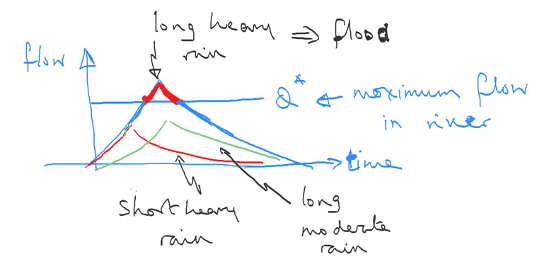

# Lecture 14: River Flows

The previous section focussed on flow in the catchment towards a river.
Some very simplified models for the surface run-off in terms of the rainfall flux were developed to help inform relationships between the rainfall rate and the rate at which this flows into a river.

To interpret these models of the surface runoff, we need a model for the flow in a river to understand if the river can accommodate the flow, or if it will overtop its banks and flood.
As a simple model, a river has a cross-section area $A(h)$ as a function of the water depth, and the water in the river moves downstream with speed $u$.
If the river inclination is q then the gravity force downslope is

```{math}
:label: gravity
F_g = g \sin(\theta) \rho A
```

and the drag force resisting this flow is

```{math}
:label: drag
F_d = c \rho g u^2 P(h)
```

Where $P(h)$ is the wetted perimeter of the river bed.



If we balance these flows we find that the speed

```{math}
:label: grav_drag_balance
U(h) = \sqrt{\frac{A(h) g \sin(\theta)}{c P(h)}}
```

And the volume flow in the river is approximately

```{math}
:label: river_vol
Q = A(h) u(h)
```

In a specific example, we might consider that the river area $A(h) = a h^2$ and that the perimeter $P(h) = b h$ so that

```{math}
:label: parabolic_river
Q(h) = \sqrt{\frac{\alpha^3}{\beta}} \sqrt{\frac{g \sin(\theta)}{c} } \frac{h^5}{2}
```

is the law for the flux in the river.


This provides a reasonable simplified model for the flow in many rivers, for example the chart above compares this formula with data from the River Severn showing flow as a function of the water depth.

An initial result emerging from this model is that if the level of the banks are at $z = h^*$ above the base of the river, then the critical flow rate of water in the river above which it begins to flood is

```{math}
:label: critical_flow
Q^* = Q(h^*)
```

If we want to use this model for the river flow to reduce the flood we see that the key controls we have are (a) raising the height of the banks; (b) deepening the river; (c) widening the river.


Figure to illustrate river mitigation strategies to prevent flooding of a river.

Our earlier idealised models for the surface runoff identify how more intense and longer duration rain events lead to a greater flux reaching the river, and hence we can explore the type of rain storm which will lead to the flux exceeding the maximum river flux in terms of the model for the runoff.
Given statistics for the distribution of expected rainfall intensity and rainfall duration, it is then possible to design mitigation measures to reduce the flux arriving at the river from the run-off for a given rain storm.
There is then a cost benefit analysis to be carried out to determine the benefit of mitigating the flood risk for different intensity storms: this involves estimating the costs of the mitigation measures compared to the costs of the damage produced by the flooding multiplied by the risk of the flooding.

## 2.1 Coupled Model

If we combine the runoff model with the river model we find the following comparison plot, illustrating how different types of rainfall lead to different flow regimes (i.e. flooding or not)


This mode, although simplified, has features in common with the classical river hydrograph, as shown in the next figure, in which we plot the rainfall flux and the river flow rate as a function of time.



## 2.2 Managing flow from drainage basins - reservoirs

In order to manage flow from drainage basins, reservoirs are often developed to store the run-off upstream and hence delay the arrival of the run-off into the river.
Delaying and spreading out the arrival of the run-off represents a very effective means of mitigating a flood.
We can model how a reservoir operates as follows.

If a reservoir has storage volume $V$ then the volume of water $V_w$ in the reservoir follows the law

```{math}
:label: reservoir_eqn
\frac{d V_w}{dt} = kW – \mathrm{Out}
```

where $kW$ is the inflow from the drainage system, channeled into the reservoir, and $\mathrm{Out}$ is the outflow flow from the reservoir to the river.
This output flow is typically controlled by the height of the water in the reservoir, $h$, above the outflow opening which has area $A(h)$, and through which the flow is released

```{math}
:label: res_outflux
\mathrm{Out} = A \sqrt{2gh}
```

We can write

```{math}
:label: reservoir_int
V_w = \int_{z=o}^{z=h} X(z) dz
```

where $X(z)$ is the area of the reservoir when it has depth $z$.

Using the above equations, we can solve for the change in depth of the reservoir given (i) the history of the rainfall and knowledge about the drainage basin, to allow us to estimate $kW(t)$, and (ii) knowledge of the reservoir opening $A$ to allow us to estimate the loss of water from the reservoir.

In the simple case that $X(z)$ is a constant, there is an equilibrium between the run-off from the rainfall and loss of water from the reservoir,

```{math}
:label: reservoir_eq
h_{\mathrm{eq}} = \frac{k^2 W^2}{2 A^2 g}
```

If the reservoir is deeper, then it will tend to empty and the reservoir is shallower then it will fill up.
Until the reservoir is full it can be used to regulate the outflow from the drainage basin into the river, and hence mitigate the impact of very heavy rain.
However, the ultimate mitigation of the rain depends on the volume of the reservoir compared to the volume of the rainfall.
Under-sizing the reservoir will provide some protection from very high run off rates but it may not be sufficient for the run off to remain smaller than the flow capacity of the river; however, the larger the reservoir, the more expensive.


Simple illustration of the benefit of a reservoir for delaying the flow into a river and hence mitigating the impact of rapid surface run off rates in a large rain storm.

## 2.3 Sediment transport

One of the challenges of flow filling a reservoir is that the flow slows down and any suspended particle matter in the flow will tend to sediment.
Over time this can lead to a build up of sediment and reduced effectiveness of a reservoir.
Each year reservoirs may lose 0.5-1% of their volume owing to sedimentation.
In addition, they starve the land downstream of sediment and associated nutrients trapped with the sediment.

Interesting examples where sedimentation behind dams has had an impact include the $520 \ \mathrm{MW}$ Dez hydroelectric dam in Iran, where sedimentation has raised the riverbed by $2 \ \mathrm{m}$ per year, losing 19% of the power generation over the past 40 years of operation.
As the sediment bed builds up to the level of the off-take, operation of turbines becomes progressively more challenging owing to the sediment.
The Three Gorges Dam in China has on the Yangtze river has a power generating capacity of $22,500 \ \mathrm{MW}$; the sediment storage part of the reservoir is $17 \times 10^9 \ \mathrm{m}^3$ while the remaining $22 \times 10^9 \ \mathrm{m}^3$ will be retained by flushing the sediment from the bed.
In Britain, the average sediment load tends to about $50 \ \mathrm{tones \ km^{-2} \ yr^{-1}}$ but this depends on the source.

Sediment transport and deposition is a complex process.
However, a simple rule of thumb is that the sediment begins to settle when the flow speed of the becomes smaller than a multiple of about 20 times the particle settling speed, and the particles are no longer suspended.

```{math}
:label: settling_speed
U < V_{\mathrm{s}} \theta
```

where $\theta$ is the angle of slope (assumed to be small) and $V_s$ is the settling velocity of the particle.
Note this is a very simplified relation.

The settling speed of (small) particles is given by Stokes Law after Sir Gabriel Stokes of Pembroke College

```{math}
:label: stokes_law
V_s = \frac{2 g \Delta \rho r^2}{9\mu} 
```

where $\Delta \rho$ is the density difference of the particle and the water, typically about $1500 \ \mathrm{kg \ m^{-3}}$ for silica type particles, $r$ is the particle radius, and $\mu$ is the fluid velocity.


It is seen that particles of size $0.1-1.0 \ \mathrm{mm}$ have settling speeds of $0.02-2.0 \ \mathrm{m \ s^{-1}}$, and so these will be expected to sediment in a reservoir as the flow slows and fills the reservoir.
The very small particles may remain suspended depending on the flow speed in the reservoir.
