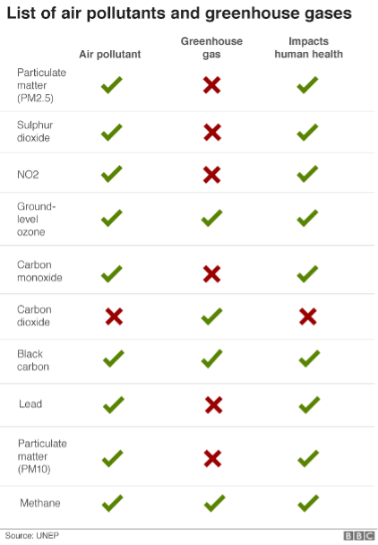

# Lecture 20: Air pollution

```{rubric} Sources, sinks and trends
```

```{highlights}
_Aims:_
1. To survey the main constituents of air pollution around the world and over time.
2. To outline the main sources and sinks of different air pollutants, focusing on NO2 and particulate matter.
3. To review historic trends of air pollutants and how they are measured.
4. To apply the beer-lambert law to determine the abundance of air pollutants using remote measurement techniques.

_Key Points:_

- Air pollution is not a new phenomenon and work to legislate air pollution can be traced back to the middle ages.
- The main air pollutants are oxidising gases (NO2, O3) and particulate matter.
- NO2 is only produced naturally from lightning, it's main source is the internal combustion engine.
- NO2 has a weak chemical-bond which allows low energy photons from the sun to break it apart.
- Since the industrial revolution the amount of NO2 has increased dramatically and disproportionately.
- COVID lockdowns showed that NO2 can be controlled very quickly.
```

## What is air pollution

Ait pollution is a phrase used to describe the presence of contaminants in the air that are harmful for life, to buildings or to climate.

There are lots of different air pollutants. Most are present at trace levels (c.f. the majority of the atmosphere is made up of N2, O2, Ar and H2O). These pollutants can come from a range of different sources including, man-made – or anthropogenic – and natural – or biogenic.

The table below lists many important air pollutants.



## Sources of NO2

The oxides of nitrogen (NOx = NO + NO2) play a dominant role in the chemistry of the troposphere, as we will find in the following sections. They arise from a combination of natural and anthropogenic sources. _Road transport_ is an important, and rapidly growing, NOx source. Most lightning is associated with deep convection and the largest sources are in the tropics. Only lightning and aircraft are non-surface sources.


**Table 20.1** Sources and sinks (and ranges of uncertainty) of atmospheric NOx

NO2 absorbs strongly in the UV and visible part of the solar spectrum. This has two important consequences.

1. NO2 undergoes photolysis (photodissociation) rapidly.
2. NO2 can be observed easily from space.

Making use of (2) the figure below shows maps of the distribution of NO2.


Figure X. Measurements from the Copernicus Sentinel-5P satellite mission between April and September 2018. Credit ESA and KNMI.

## Photodissociation

The photo-reaction:
AB + hn®A + B

Has an associated _rate constant_ (or photolysis frequency) _J__AB_ _(s__-1__)_ and a _rate of reaction_ RJ (molecules cm-3 s-1), where RJ = _J__AB_[AB]

The rates of change of the molecules are:

Equation X

_8.2.1 Calculation of photolysis frequency J_
The photolysis frequency _J__i_ of constituent _i_ is defines as:

Equation X

where is the wavelength dependent absorption cross-section (cm2), is the wavelength dependent quantum yield (efficiency), and is the photon intensity at wavelength.

To calculate the photon intensity with the atmosphere at altitude z, it is necessary to compute the transmission of the atmosphere at that wavelength. To do this we use the _Beer Lambert Law_:

Equation X

where is the photon intensity at the top of the atmosphere, and is the atmospheric _optical depth_, defined as:

Equation X

where the summation is over all _i_ absorbing species, is the cross-section (cm2) and _N__i_ the total number of molecules of absorber _i_ between z and the top of the atmosphere (cm-2).

To an excellent approximation we need only to consider O2 and O3 when calculating the O.D

In each case _N_ is defined as:

Equation X

where [n]_z_ is the concentration of O2 or O3 at altitude z.

Calculation of _N__O_2 is straightforward as O2 is uniformly mixed in the atmosphere.

The major factors determining fluxes of radiation in the visible and UV wavelengths in the atmosphere are absorptions by O2 and O3. Other factors include Rayleigh scattering, and in the troposphere, the presence of clouds which can act to increase or reduce photolysis rates, and the Earth's albedo.

Figure 1.2 shows the regions of the spectrum where the bands of O2 and O3 which absorb in the Earth's atmosphere are located (O3 has an additional weakly absorbing band at visible wavelengths – the Chappuis bands).

A detailed knowledge of the absorption properties of the atmosphere is required for a full understanding or for accurate modelling of atmospheric photochemistry. However, there are a number of wavelengths which are of particular significance for understanding some of the basic principles. Firstly, = 242 nm is the longest wavelength (i.e. the lowest energy) at which photons can dissociate O2 thereby producing O3 _directly_ from O2:

O2 + hn®O + O

(O + O2 + M ®O3 + M\*)

Secondly = ~400 nm is the longest wavelength at which NO2 can be photolysed (NO2 does absorb at longer wavelengths, but the _quantum yield_ for dissociation falls rapidly to zero). The fate of the ground state O atom formed is to recombine with O2 thereby _indirectly_ forming O3:

NO2 + hn®NO + O

O + O2 + M ®O3 + M

Also, = ~310 nm is also highly significant as it is the longest wavelength at which O3 can be photolysed to form excited atomic oxygen O(1D), leading to the production of OH

Changes in NO2 over time.


Figure X. Modelled changes in NO2 and SO2 from 1850 to 2014 highlight the rise (and decline) of these pollutants across the globe (and Europe).


Figure X: The impacts of the COVID lockdowns on NO2 levels across Cambridge. The clearest signal of change is at Regent Street and Parker Street, where levels dropped to unprecedentedly low levels.

