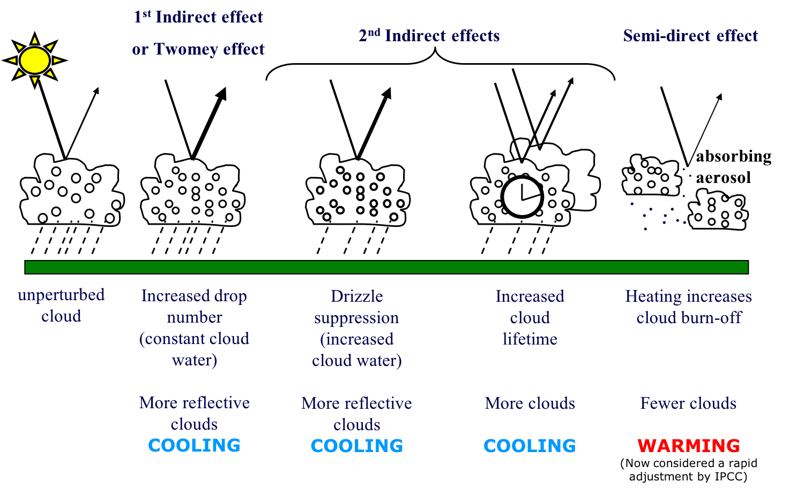

# Lecture 24: Air pollution and climate – indirect effects

```{rubric} Cloud formation, aerosol-cloud interactions
```

```{highlights}
Aims:

1. To describe how clouds form in the atmosphere
2. To describe the role of aerosols on cloud formation
3. To describe the impacts of aerosols on cloud characteristics and lifetime.

Key points:

- Clouds are formed when air parcels become supersaturated, which usually occurs when air rises and cools
- Aerosol particles are needed to provide a nuclei for cloud droplets to form on
- Droplet formation is best described using the Koehler equation, which combines the Kelvin equation (curvature effect) with the Raoult equation (solute effect)
- As droplets grow inside clouds, the rate of growth due to condensation slows down and other processes (e.g., accretion) become more important.
- An increase in CCN makes clouds brighter, causing a negative forcing.
- The negative forcing from aerosols has offset some warming from greenhouse gases in the 20th century, but this effect is decreasing due to policies to tackle air quality.
```

## Role of aerosol particles in cloud formation

### Cloud formation

In the atmosphere, clouds form as a result of a combination of thermodynamic and microphysical processes. For a cloud to form, it is necessary for a large volume of moist air to become saturated. The **vapour pressure** of water in the parcel is referred to as , and is the **saturation vapour pressure** of water in equilibrium with a plane surface of water at the temperature of the parcel.

The Clausius-Clapeyron equation allows us to calculate the variation of _e__s_ with temperature.

where _L_ is the latent heat of vapourisation and _M__v_ the molecular weight of water. If we assume that _L_ is constant, independent of T, then integrating the Clausius-Clapeyron equation gives:

or

where _e__s_ is in hPa (mbar) and _T_ in Kelvin. As _e__s_ increases exponentially with _T_, if an air parcel cools (without changing _e_) the air parcel will change from being **subsaturated** to **supersaturated**.


_Figure 10. Schematic of the saturation vapour pressure of water._

When discussing cloud droplet formation, the **saturation ratio (S)** and **supersaturation (s)** (both unitless) are useful variables, defined as follows:

- **saturation ratio (unitless)**:

with:

_S_ \< 1 for a subsaturated (evaporation \> condensation) environment,

_S_ = 1 for saturation (condensation = evaporation), and

_S_ \> 1 for a supersaturated (condensation \> evaporation) environment.

- **supersaturation (unitless):**

with:

_s_ = 0 at saturation,

_s_ \< 0 for a subsaturated environment, and

_s_ \> 0 for a supersaturated environment.

A parcel of air which is saturated with respect to water defines the concept of **relative humidity (RH)**, since relative humidity is defined as the mass mixing ratio ω of a parcel at a particular temperature and pressure, compared to its saturation mixing ratio value at the same temperature and pressure:

The equation for the saturation ratio only applies for a flat surface of pure water. Once we consider actual particles, we get into situations where **curvature or the effect of a solute needs to be considered**. In these cases, supersaturation needs to be considered relative to the equilibrium value of _e_ for a particular curved surface_,_ so we refer to _e __\*_ as the **equilibrium vapour pressure,** whichcan differ from _e__ s_ over a flat plane surface.

In the atmosphere, supersaturation can be achieved, in principle, via three basic mechanisms: **radiative cooling** , **u**** plift **, and** m ****ixing**. Note that radiative cooling and mixing happen at constant pressure (isobaric), whereas uplift happens at constant energy (adiabatic). In the atmosphere, uplift or adiabatic expansion of ascending air is the most prevalent mechanism for a parcel of moist air to be cooled below Td in order to reach supersaturation (see **Figure 11** ).We will see later that in an ascending parcel, the updraft velocity affects the rate of cooling and hence the amount of condensation which forms.


_Figure 11. Schematic of changes in relative humidity (RH) and supersaturation for a parcel of air rising in a cloud._

### Koehler theory

Cloud formation is best described by **Koehler theory** [_Köhler_, 1936], which combines two competing effects that most strongly determine the amount of supersaturation that a specific particle must experience in order to accumulate enough water to grow into a cloud drop. The first is a physical effect of curvature which increases the droplet's equilibrium vapour pressure; this is called the **Kelvin effect**. The second is a chemical effect of the aerosol dissolving in the growing water drop and thereby reducing its equilibrium vapour pressure; this is called the solute effect or **Raoult's Law**.

#### Kelvin effect (curvature effect)

The Kelvin effect states that the equilibrium vapour pressure over a curved surface (e.g. a solution droplet with a finite radius r) is much greater than the saturation vapour pressure over a plane or flat surface.

The **Kelvin equation** is given as:

, where

Where is the surface tension between water and air, and is the density of the droplet evaluated at T. _R_ is the molar gas constant. At 273.2 K, is 0.0756 N m-1.

Figure 12 shows a plot of the Kelvin equation. Smaller particles need a higher supersaturation to grow because their surfaces are more curved and water evaporates from them more easily.


_Figure 12. Vapour pressure over a curved surface for pure H2O at 298 K. Figure credit: W. Brune (Penn State University)._

#### Solute effect (Raoult's Law)

Aerosol particles are abundant in the atmosphere and some of the particles are hydrophilic and water soluble. In terms of droplet growth, this solubility is fortunate because the saturation vapour pressure over a solution is lowered by the presence of the solute compared to that of pure water and hence growth is energetically favourable. This is described by **Raoult's Law**.

Phenomenologically (and in a simplified manner) this vapour pressure reduction can be understood as follows: solute molecules (i.e. the chemical that is being dissolved in the solvent) occupy surface sites that would otherwise be occupied by water molecules (the solvent), which in turn prevents water molecules from evaporating from those sites as shown in **Figure 13**. Consequently, a droplet containing, for instance, dissolved salt favours condensation more than would a pure water droplet of the same size. In other words, existing particles onto which water vapour condenses ( **cloud condensation nuclei;** CCN) enable condensation at supersaturations well below those required for **homogeneous nucleation** (primarily because of their size) as discussed further below.


_Figure 13. Schematic of the saturation vapour pressure for (a) pure water, and (b) an ideal solution. The white disks denote water molecules, and the black disks dissolved molecules. The reduction in vapour pressure from (a) to (b) corresponds to there being fewer sites from where water molecules can escape through the air–water interface. Figure from Lohmann et al. [2016]._

Raoult's Law states that the saturation vapour pressure of an ideal solution is dependent on the vapour pressure of each chemical component and the mole fraction of the component present in the solution, so:

where is the equilibrium vapour pressure over a solution consisting of water molecules and solute molecules.

For dilute solutions applied to droplets of size _r_, Raoult's Law can be approximated as:

, where

where is the total mass of the solute, and are the molecular masses of the solute and water respectively, is the density of the droplet, and is the _Van't Hoff factor_ which accounts for ionic dissociation of the solute. An example is salt, NaCl, which splits into two ions in solution, Na+ and Cl-, which means that _i_ _= 2_ in this case.

#### Koehler equation: combining Kelvin equation and Raoult's Law

The **Koehler equation** combines the competing effects of the Kelvin equation and Raoult's law as follows:

The Koehler equation describes the ratio between the equilibrium vapour pressure over a solution droplet with radius to the saturation vapour pressure over a plane surface of water , with and as described in the Sections above.

As a \<\< r and b \<\< r3, expanding each term in S and neglecting higher order terms yields:

Figure 14 shows a Koehler curve, i.e., the saturation ratio as a function of the droplet radius, and separate curves for the curvature and solute effects.


_Figure 14. Exemplar Koehler curve (black line) with red dashed line indicating the contribution from Raoult's Law and the dotted line that from the Kelvin equation. Figure from Ritchie [2017]._

From **Figure 14** , it can also be seen that the Kelvin effect is negligible for droplets larger than 1 m where all curves approach S=1.

The peak of a Koehler curve corresponds to the so-called **critical saturation ratio** , _S __c_ at the **critical radius** , _r__ c_(that is typically between 0.1 µm and 1.0 µm). _S __c_ and _r__ c_ can be obtained by differentiating the Koehler equation with respect to r and setting the derivative to 0:

;

_S__c_ of a specific Koehler curve is the minimum saturation ratio that is required for the corresponding solution droplet to grow to cloud droplet size. Theoretically, it could grow even larger, but the growth rate becomes slower the larger the droplet, and more efficient growth mechanisms such as growth by **collision-coalescence** (a.k.a. accretion) with other droplets will take over. If the droplet has grown to _r \> r__c_, it is called an **activated droplet**. All droplets that have a critical saturation ratio _S __c_ _\< S__ max_ can thus be activated, where _S __max_ is the **maximum**** supersaturation** reached in the cloud. _S__ max_ is itself a function of updraft velocity – in clouds with faster updrafts (such as storm clouds) _S__max_is higher, meaning smaller particles can be activated and more droplets are formed overall. In the context of cloud formation, the number of activated particles is always small (about 200 cm-3) compared with the total number of particles in the atmosphere.

Activation of nucleation-mode aerosol particles requires very high supersaturations that do not exist in the atmosphere. In contrast, larger aerosol particles require smaller supersaturations to be activated, thus these larger particles act more readily as CCN, but it is important to remember that there are fewer of them.

## Aerosol- cloud interactions

**Aerosol-cloud interactions** (also known as aerosol indirect effects) refer to the modification of cloud properties due to changes in the aerosol population as summarized in **Figure 15**.



_Figure 15. Summary of aerosol-cloud interactions and their climate effects. Based on IPCC AR5._

An increase in **cloud condensation nuclei, CCN** (i.e. a subset of the total aerosol population that can activate to form cloud droplets) number concentration will result in an increase in the number concentration of cloud droplets. These droplets compete for the available cloud liquid water content in order to grow to larger sizes. Under the assumption that the liquid water content remains constant, the increase in CCN number concentration will lead to more numerous but smaller-sized cloud droplets compared to those in an unperturbed "clean" cloud since droplet radius goes as where refers to the liquid water content (g/m3) and is cloud droplet number concentration (cm-3).

For a cloud of thickness (in m), the **cloud optical thickness,** , is related to cloud properties as follows:

Therefore, for a constant liquid water content and a constant cloud thickness, increases with .

A larger number of smaller-sized cloud droplets in a polluted cloud increase the total cloud droplet surface area, which results in the cloud albedo increasing (i.e. the cloud becoming brighter). A polluted cloud thus reflects more incoming solar radiation back to space and causes a negative radiative forcing since the fraction of solar radiation that is reflected back into space is proportional to the total cross-section area of droplets per projected area of cloud. This effect is referred to as **1**** st **** indirect effect **or** Twomey effect** after [_Twomey_, 1974; 1977].

In general, the greater the number concentration of aerosol particles, the greater but this relationship is non-linear because cloud droplets suppress supersaturation more effectively at high number concentrations, which prevents smaller-sized particles from activating. The resultant change in cloud albedo, due to a change in is referred to as **cloud albedo susceptibility** [_Platnick and Twomey_, 1994], which can be derived by combining Twomey's expression for optical thickness with a simple expression for cloud albedo :

The increase in CCN number concentration can lead to further microphysical adjustments of a cloud. One such adjustment that mostly affects boundary-layer clouds is referred to as **cloud lifetime effect** or Albrecht effect [_Albrecht_, 1989]. This refers to a slow-down of the formation of precipitation in polluted clouds because smaller droplets have a lower collision efficiency than larger droplets, and the lack or delay of precipitation prolongs the lifetime of a cloud. In more detail, in clean conditions a cloud consists of a few cloud droplets with a broader size distribution that contains at least some large particles that efficiently initiate the collision-coalescence process and form drizzle and rain (as opposed to a polluted cloud with a narrow size distribution and a lack of large particles).

A further indirect effect of aerosol on clouds that has been suggested is related to the presence of absorbing (e.g. black carbon) aerosol particles (previously referred to as **semi-indirect effect** ). Absorbing aerosol particles may heat the lowermost atmosphere and thus suppress cumulus cloud formation (or burn off these clouds) by stabilizing the boundary layer and reducing relative humidity.

21